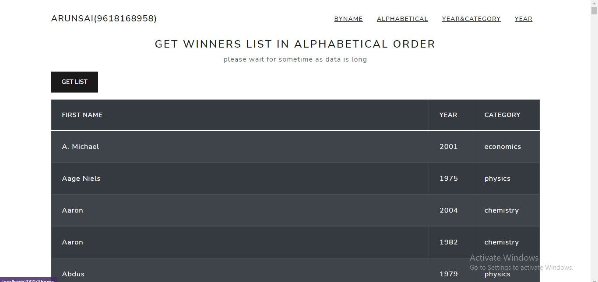
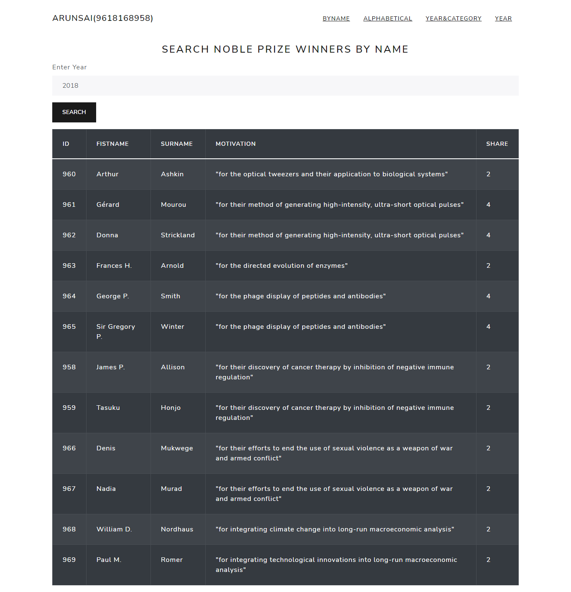
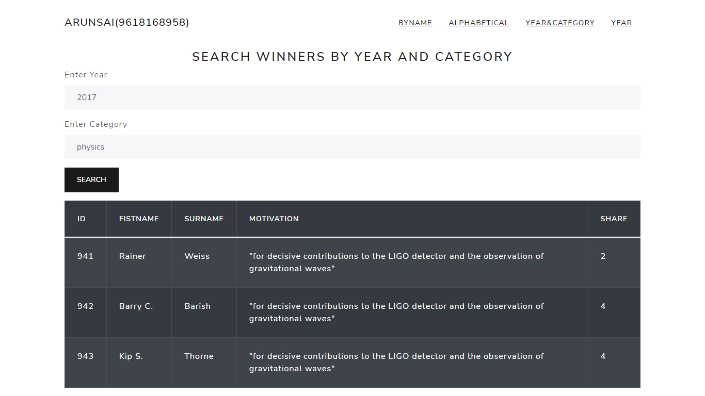
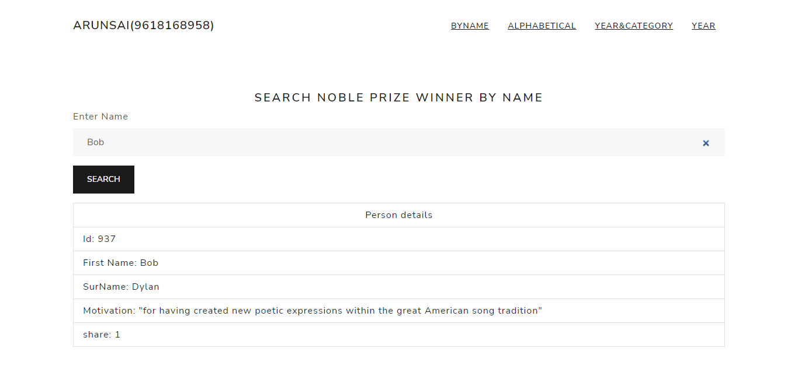

# Summit-minds

to run this clone this repo or download
1. "npm i" in summit minds folder
2. "cd client" and "npm i"
4. and again go to root folder and "npm run dev" to start server
5. images are shown below 

